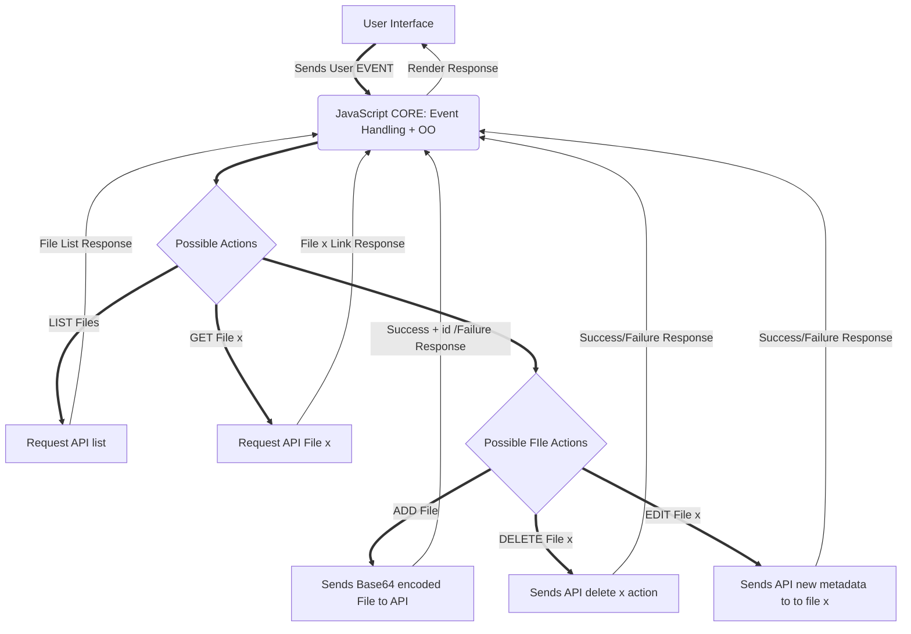

# JoaQUEEN-quick-start

### Multiplatform Application built to work with the [vialRackAPI](http://github.com/auyer/vialRackAPI), being able to consume and add Data to it using JSON.


## Model Flow


Mermaid FLow Graph code: 



## To Use

To clone and run this repository you'll need [Git](https://git-scm.com) and [Node.js](https://nodejs.org/en/download/) (which comes with [npm](http://npmjs.com)) installed on your computer. From your command line:

```bash
# Clone this repository
git clone https://github.com/auyer/joaQUEEN/
# Go into the repository
# Install dependencies
npm install
# Run the app
npm start
```

Note: If you're using Linux Bash for Windows, [see this guide](https://www.howtogeek.com/261575/how-to-run-graphical-linux-desktop-applications-from-windows-10s-bash-shell/) or use `node` from the command prompt.

## Resources for Learning Electron

- [electron.atom.io/docs](http://electron.atom.io/docs) - all of Electron's documentation
- [electron.atom.io/community/#boilerplates](http://electron.atom.io/community/#boilerplates) - sample starter apps created by the community
- [electron/electron-quick-start](https://github.com/electron/electron-quick-start) - a very basic starter Electron app
- [electron/simple-samples](https://github.com/electron/simple-samples) - small applications with ideas for taking them further
- [electron/electron-api-demos](https://github.com/electron/electron-api-demos) - an Electron app that teaches you how to use Electron
- [hokein/electron-sample-apps](https://github.com/hokein/electron-sample-apps) - small demo apps for the various Electron APIs

## License

[CC0 1.0 (Public Domain)](LICENSE.md)
